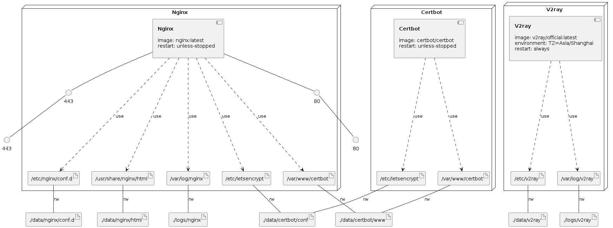

# 使用docker-compose以ws+tls方式快速部署科学上网利器v2ray


## 更新日志

* 2020年3月3日：增加v2ray并使用ws+tls方式实现代理服务；
* 2020年3月1日：增加nginx服务并启用certbot证书；

## 使用步骤

1. 获取域名及VPS

* 免费域名注册： <a href="https://gogogo.link/b" target="_blank">免费域名申请</a>；；
* VPS推荐搬瓦工，支持支付宝付款： <a href="https://www.4spaces.org/best-details-to-buy-banwagonhost/" target="_blank">史上最详细搬瓦工VPS注册/购买图文教程(内附优惠券)</a>
* 搬瓦工： <a href="https://www.4spaces.org/bwg/static/promotion.html" target="_blank">当前促销方案</a>
* 通过此【<a href="https://gogogo.link/1" target="_blank" rel="noopener noreferrer">链接</a>】注册Vultr VPS，当你消费满$35，即可获得$100返券，推荐上新的 <a href="https://gogogo.link/a" target="_blank">Vultr韩国机房</a> 。
* [2021最新基于nginx搭建v2ray服务端配置vmess+tls+websocket详细教程（图文）](https://www.4spaces.org/install-v2ray-on-debian-2021/);
* 极力推荐：<a href="https://www.4spaces.org/racknerd-start-tutorial-2021-618/" target="_blank" rel="noopener">racknerd(17.88刀/年，5T流量/月)快速搭建v2ray服务端配置vmess+tls+websocket详细教程（图文）</a>

* <a href="https://www.4spaces.org/racknerd-start-tutorial/" target="_blank" rel="noopener">racknerd(12.79刀/年，3T流量/月)快速搭建v2ray服务端配置vmess+tls+websocket详细教程（图文）</a>


2. 安装docker-ce并启动

以下操作我都是以root用户(非必须)进行的。

* 安装

```
$ curl -fsSL https://get.docker.com -o get-docker.sh
$ sh get-docker.sh
```

**注：** 这一步如果是CENTOS 8，可能会出现 `requires containerd.io >= 1.2.2-3错误` -> [解决办法](https://www.4spaces.org/docker-ce-install-containerd-io-error/)。

* 添加用户到用户组(需退出当前会话重启登录才生效)

```
gpasswd -a $USER docker
```

* 启动

```
systemctl start docker
```

* 设置docker开机自启动

```
systemctl enable docker
```

3. 安装`docker-compose`

```
$  curl -L "https://github.com/docker/compose/releases/download/1.24.0/docker-compose-$(uname -s)-$(uname -m)" -o /usr/local/bin/docker-compose

$ chmod +x /usr/local/bin/docker-compose

$ ln -s /usr/local/bin/docker-compose /usr/bin/docker-compose
```

4. 安装git并clone代码

```
yum -y install git


git clone https://github.com/aitlp/docker-v2ray.git
```

或者你可以下载后在上传到你的VPS。

5. 修改v2ray配置

进入`docker-v2ray`目录开始修改配置。

**1) `init-letsencrypt.sh`**

将里面的`domains`和`email`修改为自己的域名和邮箱。

**2) `docker-compose.yml`**

可以不用动。

**3) `data/v2ray/config.json`**

修改ID，`"id": "bae399d4-13a4-46a3-b144-4af2c0004c2e"`，也可以不修改。

**4) `data/nginx/conf.d/v2ray.conf`**

修改所有`your_domain`为自己的域名，其他地方，如果上面可以修改的地方你没修改，那么除了域名之外的也不用修改了。

6. 一键部署v2ray

```
chmod +x ./init-letsencrypt.sh

bash init-letsencrypt.sh
```

7. 进行v2ray客户端配置

现在你可以开始使用了。

细节参考： <a href="https://www.4spaces.org/docker-compose-install-v2ray-ws-tls/" target="_blank" rel="noopener noreferrer">在docker-compose环境下以ws+tls方式搭建v2ray(So easy)</a>

相关配置参考： <a href="https://www.4spaces.org/v2ray-nginx-tls-websocket/" target="_blank" rel="noopener noreferrer">centos7基于nginx搭建v2ray服务端配置vmess+tls+websocket完全手册</a>

交流Telegram群组：[三好学生](https://t.me/goodgoodgoodstudent);

### Infrastructure model

